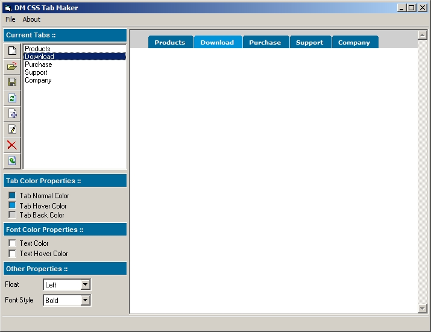



## DM CSS Tab Maker

### Description

DM CSSTAB Maker is a small tool that can allow you to design colorful tabs for you website, you can open projects, save projects, and also export the html page and gifs anyway I hope you like this first version, I also made some template projects for you to test,
 
### More Info
 

             |
---                |---
**Submitted On**   |2008-12-18 21:03:38
**By**             |[dreamvb](https://github.com/Planet-Source-Code/PSCIndex/blob/master/ByAuthor/dreamvb.md)
**Level**          |Beginner
**User Rating**    |5.0 (20 globes from 4 users)
**Compatibility**  |VB 6\.0
**Category**       |[Internet/ HTML](https://github.com/Planet-Source-Code/PSCIndex/blob/master/ByCategory/internet-html__1-34.md)
**World**          |[Visual Basic](https://github.com/Planet-Source-Code/PSCIndex/blob/master/ByWorld/visual-basic.md)
**Archive File**   |[DM\_CSS\_Tab21375912192008\.zip](https://github.com/Planet-Source-Code/dreamvb-dm-css-tab-maker__1-71543/archive/master.zip)

